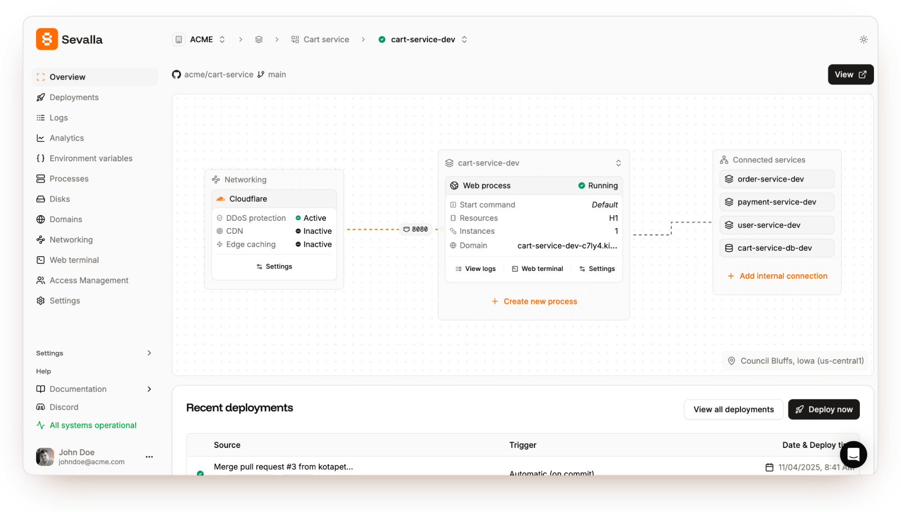

<picture>
  <source media="(prefers-color-scheme: dark)" srcset="assets/banner-dark.svg">
  
</picture>

I'm a Senior Staff Developer at **[Sevalla](https://sevalla.com/?utm_source=github&utm_medium=profile)**, a platform for shipping apps, databases, object storage and static sites to production without managing infrastructure. Under the hood it's Kubernetes. On top, it's a `git push`.

## Sevalla

<a href="https://sevalla.com/?utm_source=github&utm_medium=profile">
  <picture>
    <source media="(prefers-color-scheme: dark)" srcset="assets/sevalla-dark.png">
    
  </picture>
</a>

- **Application hosting.** Deploy from GitHub, GitLab or Bitbucket, or from a Docker image, and scale without touching a cluster.
- **Database hosting.** Managed PostgreSQL, MySQL, MariaDB, Redis and Valkey.
- **Object storage and static sites**, next to your apps. Static sites are free.
- **25 data centers and 260+ PoPs**, with pricing by the resources you use. No plans, no seats.

**[Try Sevalla](https://sevalla.com/?utm_source=github&utm_medium=profile)** · [Docs](https://docs.sevalla.com/?utm_source=github&utm_medium=profile) · [Pricing](https://sevalla.com/pricing?utm_source=github&utm_medium=profile)

### Tools I've built for Sevalla

- [**cli**](https://github.com/sevalla-hosting/cli): the official CLI. Deploy apps, manage databases, configure domains and watch metrics from your terminal.
- [**mcp**](https://github.com/sevalla-hosting/mcp): the official remote MCP server, so AI agents can work with the Sevalla API.
- [**sevalla-deploy**](https://github.com/sevalla-hosting/sevalla-deploy): a GitHub Action that deploys and promotes Sevalla apps and static sites.
- [**terraform-provider-sevalla**](https://github.com/sevalla-hosting/terraform-provider-sevalla): manage Sevalla infrastructure with Terraform.

## Lumovi

Sevalla runs on Kubernetes, so we watch a lot of clusters. I wanted to see how they're doing at a glance, so I built **[Lumovi](https://lumovi.dev)** (it was called KubeStacks): a fast, free and open-source Kubernetes dashboard, on your desktop for every cluster in your kubeconfig, or in your cluster for your whole team. It shows what's healthy, what's struggling and where your capacity goes, and helps you fix things safely.

<a href="https://github.com/Lumovi/Lumovi">
  <picture>
    <source media="(prefers-color-scheme: dark)" srcset="https://raw.githubusercontent.com/Lumovi/Lumovi/main/docs/screenshots/overview-dark.webp">
    
  </picture>
</a>

**[Download for macOS, Windows or Linux](https://github.com/Lumovi/Lumovi/releases/latest)** · [Install in a cluster](https://docs.lumovi.dev/server/install) · [Source](https://github.com/Lumovi/Lumovi)
